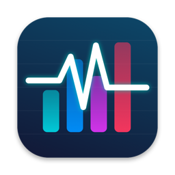
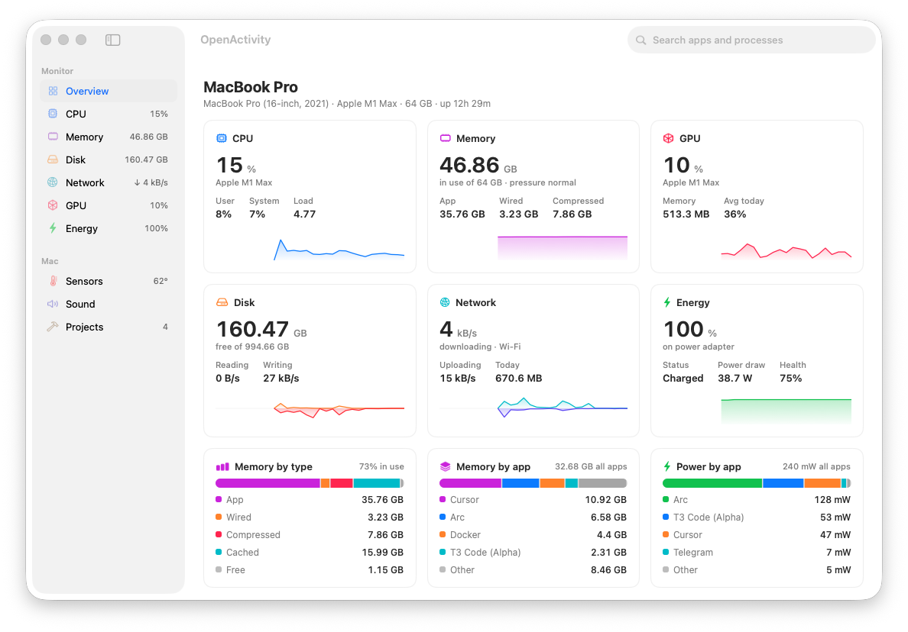
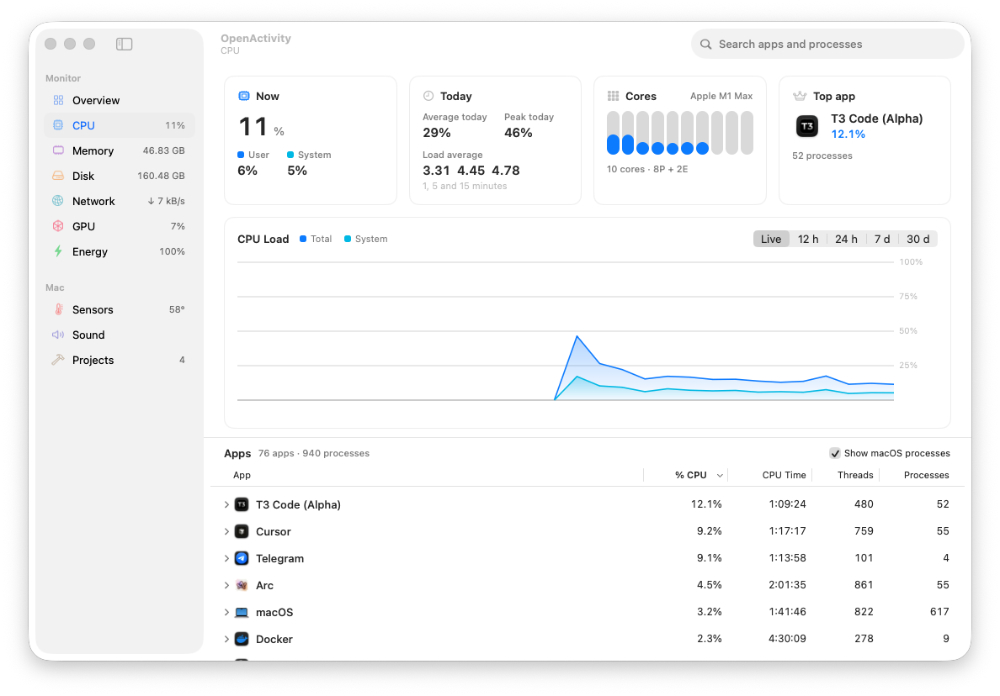
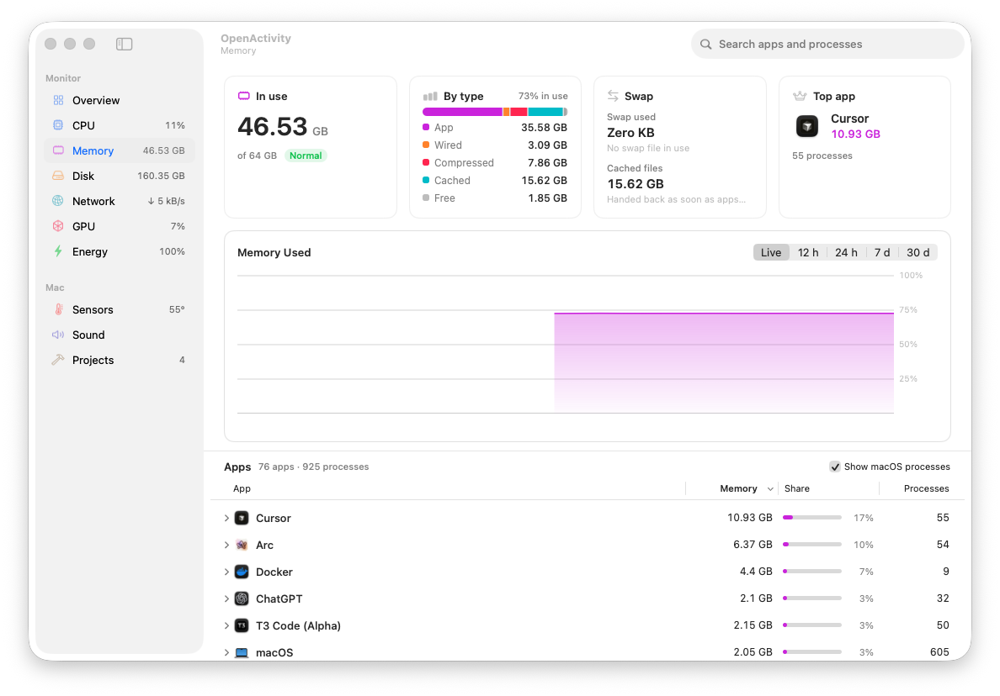
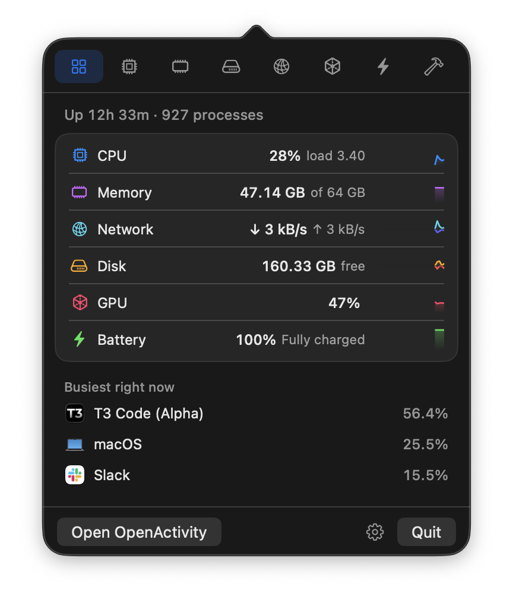
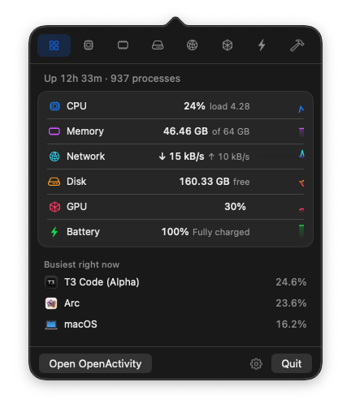
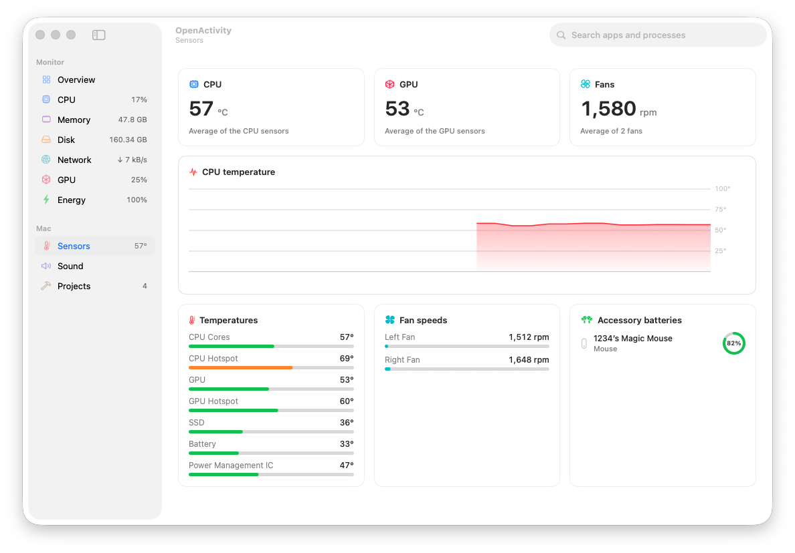

<div align="center">



# OpenActivity

**An open-source Activity Monitor for macOS that thinks in apps, not processes.**

Your Mac runs close to a thousand processes. OpenActivity folds every helper, renderer and<br>
background service into the app that started it — so "what is slowing my Mac down?" has a one-line answer.

[](#requirements)
[](#building-from-source)
[](#how-it-works)
[](LICENSE)
[](https://github.com/Ffinnis/OpenActivity/releases/latest)

[**Download**](https://github.com/Ffinnis/OpenActivity/releases/latest) · [Website](https://ffinnis.github.io/OpenActivity/) · [Features](#features) · [Install](#install) · [How it works](#how-it-works)

<br>

<picture>
  <source media="(prefers-color-scheme: dark)" srcset=".github/assets/overview-dark.png">
  
</picture>

</div>

## Why

Activity Monitor is great at showing what is happening *this second*, one process at a time. On a working Mac that means scrolling past dozens of `Google Chrome Helper (Renderer)` rows and adding them up in your head.

OpenActivity answers the questions you actually have:

- **Which app** is using my memory, CPU, GPU, disk or network — with every helper process counted?
- **What happened while I wasn't looking?** Thirty days of history, per app.
- **Is something misbehaving right now?** A notification when an app pins the CPU or keeps growing.
- **Did I leave dev servers running?** Every `node`, `python`, `go`, `ruby`… server, grouped by project, with its ports.

It is a native AppKit app, lives in your menu bar, keeps everything on your Mac, and makes no network requests of its own.

## Features

### Processes grouped by app

Every process is attributed to the app responsible for it — Chrome's renderers to Chrome, a shell and everything it runs to Terminal, WebKit's content processes to Safari. One row per app, one figure per metric, expandable to the individual processes. Quit or force quit an app or a single process from any list; OpenActivity always asks first.

<p align="center">
  <picture>
    <source media="(prefers-color-scheme: dark)" srcset=".github/assets/cpu-dark.png">
    
  </picture>
</p>

### Every metric, with history

| Page | What you get |
| --- | --- |
| **CPU** | Total, user and system load, load averages, per-core bars for performance and efficiency cores, and each app's share. |
| **Memory** | In use, pressure, and the App / Wired / Compressed / Cached / Free split macOS uses, plus swap and each app's footprint. |
| **Disk** | Free space per volume, read and write throughput, bytes written today, and which apps are writing. |
| **Network** | Download and upload rates, totals for today, 7 and 30 days, the active interface, and per-app traffic. |
| **GPU** | Utilization, GPU memory, today's average and peak, and per-app GPU time. |
| **Energy** | Battery charge, time remaining, power draw, health and cycle count, plus power per app. |

Each page has a live chart and a history chart for the last **12 hours, 24 hours, 7 days or 30 days**, with the apps that used the most over that period. History is stored in one small SQLite file on your Mac.

<p align="center">
  
</p>

### A system monitor in your menu bar

Show an icon, one or more figures, small live graphs, or stacked figures — for CPU, memory, GPU, network, disk, temperature or battery. The icon turns into a warning sign when your Mac is under strain. Click it for a compact dashboard with a tab for every metric and the apps behind each figure.

<p align="center">
  
  &nbsp;&nbsp;
  
</p>

### Dev servers and open ports, by project

OpenActivity finds development servers, groups them by the project folder they run in (monorepos show as one project with named packages), lists the TCP ports each one holds, and points out the ones that have been idle for hours. Stop one server, a whole project, or every idle server at once — after a confirmation.

### Alerts for misbehaving apps

A notification when an app keeps the CPU busy for minutes on end, keeps growing in memory, writes heavily to disk, saturates the network, or when the whole Mac sits under critical memory pressure. Thresholds are yours to tune in Settings.

### And also

- **Temperatures, fans and batteries** — CPU and GPU temperatures, fan speeds, and the battery level of AirPods, Magic Mouse, Keyboard and Trackpad.
- **Volume per app** — turn one app down or mute it without touching the others (Core Audio process taps; nothing is recorded).
- **Share card** — export a 1200 × 630 image of your Mac's memory, top apps and CPU, in light or dark, or copy the dashboard as an image.
- **Light and dark**, keyboard shortcuts for every page (<kbd>⌘1</kbd>–<kbd>⌘9</kbd>), search across apps and processes (<kbd>⌘F</kbd>), and launch at login.

<p align="center">
  
</p>

## OpenActivity and Activity Monitor

| | Activity Monitor | OpenActivity |
| --- | --- | --- |
| What the list shows | Every process | Every app, helpers included, expandable to processes |
| History | Live graphs | 30 days for every metric, per app |
| Alerts | — | CPU, memory growth, disk, network, memory pressure |
| Menu bar | Dock icon graphs | Icon, figures, graphs or stacked figures, plus a dashboard |
| Dev servers and ports | — | Grouped by project, idle ones pointed out |
| Temperatures and fans | — | Included |
| Volume per app | — | Included |
| Source code | Closed | MIT licensed |

Activity Monitor still has specialist tools OpenActivity does not try to copy, such as sampling a process or inspecting its open files.

## Install

### Download

1. Download the latest `OpenActivity.zip` from [**Releases**](https://github.com/Ffinnis/OpenActivity/releases/latest).
2. Unzip it and move **OpenActivity.app** to `/Applications`.
3. The build is not notarized yet, so the first launch needs one extra step: open it, then go to **System Settings › Privacy & Security** and click **Open Anyway**. Alternatively run:

   ```sh
   xattr -dr com.apple.quarantine /Applications/OpenActivity.app
   ```

### Requirements

- macOS 15 Sequoia or later
- Apple silicon (Intel Macs should work; temperature and GPU readings there are less tested)

### Permissions

OpenActivity asks for only two things, both optional:

| Permission | Used for |
| --- | --- |
| Notifications | Alerts about misbehaving apps |
| Audio capture | Per-app volume. Audio is routed through a private process tap and played straight back; nothing is recorded or stored. |

The app is **not sandboxed**: the App Store sandbox would stop it from reading other apps' processes, which is the one thing an activity monitor has to do.

## Building from source

Requires Xcode 26 or later.

```sh
git clone https://github.com/Ffinnis/OpenActivity.git
cd OpenActivity
open OpenActivity.xcodeproj
```

Select your own team under **Signing & Capabilities**, then press <kbd>⌘R</kbd>. Or from the command line:

```sh
xcodebuild -project OpenActivity.xcodeproj -scheme OpenActivity -configuration Release \
  -derivedDataPath build CODE_SIGN_IDENTITY=- CODE_SIGN_STYLE=Manual DEVELOPMENT_TEAM= build
open build/Build/Products/Release/OpenActivity.app
```

## How it works

OpenActivity is written in Swift with AppKit only — no SwiftUI, no third-party dependencies. One background queue samples every two seconds while a window or the menu bar dashboard is open, and every five seconds otherwise. With the main window open it uses under 1% of one core.

| Figure | Source |
| --- | --- |
| Processes, CPU time, memory footprint, disk I/O, energy | `sysctl(KERN_PROC_ALL)` and `proc_pid_rusage` (libproc) |
| Which app a process belongs to | macOS's responsible-process attribution, then the outermost `.app` bundle in the path |
| System CPU and memory | `host_processor_info`, `host_statistics64`, `vm.swapusage`, memory pressure level |
| Disk throughput and volumes | IOKit `IOBlockStorageDriver` statistics, `getfsstat`, URL resource values |
| Network | Interface counters via `net.link.generic`; per-app traffic from a single long-lived `nettop` |
| GPU | IOKit `IOAccelerator` performance statistics and per-client GPU time |
| Battery and power | IOPowerSources and the `AppleSmartBattery` registry entry |
| Temperatures and fans | IOHID temperature sensors on Apple silicon, the SMC for fans (and temperatures on Intel) |
| Accessory batteries | IORegistry `BatteryPercent` and `system_profiler` Bluetooth data |
| Dev servers | Listening TCP sockets and working directory per process, project root found by `.git` and manifests |
| Per-app volume | Core Audio process taps with a private aggregate device |
| History | SQLite: per-minute system rows and hourly per-app roll-ups, 30-day retention |

```
OpenActivity/
├── App/            App delegate, menus, preferences
├── Model/          Snapshot value types and formatting
├── Sampling/       Samplers (process, CPU, memory, disk, network, GPU, battery, sensors) and the Monitor
├── Services/       History store, alerts, process control, per-app audio, share card
└── UI/
    ├── Common/     Theme, cards, charts, bars and rings
    ├── MainWindow/ Sidebar, Overview, metric pages, Sensors, Sound, Projects
    ├── MenuBar/    Status item and the popover dashboard
    └── Settings/   Settings window
```

## Privacy

Everything OpenActivity sees stays on your Mac. There is no account, no analytics, no update check and no network request of any kind. History lives in `~/Library/Application Support/OpenActivity/history.sqlite`; delete it any time from **Settings › History**.

## Known limitations

- macOS only reports figures for processes running under your account. Processes owned by `root` or other users (such as WindowServer) are listed without CPU, memory or disk figures.
- Per-app network traffic comes from `nettop`, the only way to get it without a privileged helper.
- On a Mac with a notch and a crowded menu bar, macOS may hide the status item. Make room by removing other items, or use **Show icon in the Dock**.

## Contributing

Issues and pull requests are welcome. Please keep the code in the style of the surrounding files: AppKit, no new dependencies, small focused types. For larger changes, open an issue first so we can talk it through.

## License

OpenActivity is available under the [MIT License](LICENSE).
